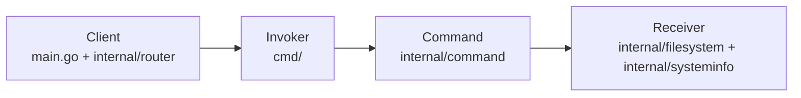

# CLI File Manager

A cross-platform command-line file manager written in Go.  
The application is structured around the **Command pattern**, making each operation (list, copy, move, hash, compress, etc.) easy to extend, test, and reuse.

## Features

- **File navigation**: `ls`, `cd`, `up`
- **File operations**: `cat`, `add`, `mkdir`, `cp`, `mv`, `rn`, `rm`
- **Compression**: `compress`, `decompress`
- **Utilities**: `hash`, `.exit`
- **System info**: `os --<flag>` for architecture, CPUs, username, home dir, EOL, etc.
- **Colored, user-friendly output**

---

## Getting Started

### Requirements

- **Go** 1.21+ (or compatible)
- **Git** (optional, for cloning)

### Installation

```bash
git clone https://github.com/KubantsevAS/cli-file-manager.git
cd cli-application

go build -o file-manager.exe
```

Run:

```bash
./file-manager.exe --username YourName
```

---

## Usage

Inside the app, you can use:

- **Navigation**
  - `ls [directory]` – list files and directories
  - `cd <path>` – change directory
  - `up` – go up one directory
- **File operations**
  - `cat <file>` – read file contents
  - `add <filename>` – create empty file
  - `mkdir <dirname>` – create directory
  - `cp <src> <dst>` – copy file
  - `mv <src> <dst>` – move file
  - `rn <file> <newname>` – rename file
  - `rm <file>` – delete file
- **Compression**
  - `compress <src> <dst>` – compress file (gzip)
  - `decompress <src> <dst>` – decompress gzip file
- **Utilities**
  - `hash <file>` – show SHA256 hash
  - `os --<flag>` – show system info (CPUs, EOL, username, etc.)
  - `.exit` – exit the program
- Or simply run `help` inside the app for a grouped, formatted list.

---

## Command Pattern Architecture

This project is intentionally structured around the **Command pattern**:

- **Command**: encapsulates a request as an object
- **Invoker**: triggers commands
- **Receiver**: does the real work
- **Client**: wires everything together

### Roles in This Project

- **Client**: `main.go` + `internal/router`
  - `main.go`:
    - Reads user input.
    - Builds the command map via `router.BuildCommandMap()`.
    - Selects the correct operation based on the command string.
  - `internal/router/router.go`:
    - Maps command names (`"ls"`, `"cp"`, `"hash"`, etc.) to small invoker functions.
    - It doesn’t know about filesystem details or business logic.

- **Invoker**: `cmd/` package
  - Files like `addFile.go`, `changeDir.go`, `compress.go`, `copy.go`, `createDir.go`, `decompress.go`, `delete.go`, `hash.go`, `help.go`, `list.go`, `move.go`, `os.go`, `read.go`, `rename.go`, `root.go`, `up.go`.
  - Each function:
    - Validates or normalizes arguments (where needed).
    - Creates the appropriate **command object** from `internal/command`.
    - Injects dependencies (e.g. `filesystem.NewLocalFS()` or `systeminfo.NewLocalSystem()`).
    - Calls `Execute(...)` and formats the result for the user (colors, labels, etc.).

- **Command objects**: `internal/command/`
  - Types such as:
    - `ListCommand`
    - `ChangeDirCommand`
    - `UpCommand`
    - `CopyCommand`
    - `MoveCommand`
    - `RenameCommand`
    - `DeleteCommand`
    - `AddFileCommand`
    - `ReadCommand`
    - `CompressCommand`
    - `DecompressCommand`
    - `HashCommand`
    - `HelpCommand`
    - `HomeDirCommand`
    - `EOLCommand`
    - `CPUsCommand`
    - `UsernameCommand`
    - `ArchitectureCommand`
  - Each command:
    - Has the required dependencies as fields (for example, `FS filesystem.FileSystem`, `SystemInfo systeminfo.SystemInfo`).
    - Provides an `Execute(...)` method that performs a single, well-defined operation.
    - Delegates actual work to the receiver interfaces, not directly to the `os` package.

- **Receivers**: `internal/filesystem` and `internal/systeminfo`
  - `internal/filesystem`:
    - Defines the `FileSystem` interface (e.g. `ChangeDir`, `List`, `Read`, `CreateDir`, `AddFile`, `Copy`, `Move`, `Rename`, `Delete`, `Hash`, `Compress`, `Decompress`).
    - `NewLocalFS()` implements those methods using the real OS.
  - `internal/systeminfo`:
    - Defines the `SystemInfo` interface (e.g. `HomeDir`, `EOL`, `CPUs`, `Username`, `Architecture`).
    - A concrete implementation provides system information.

This separation makes the **command objects independent from how input is read or how output is displayed**.  
The CLI layer (`main.go`, `internal/router`, `cmd/`) can change without touching the core logic in `internal/command` and `internal/filesystem`.

---

## Project Structure (Summary)

```text
cli-application/
  main.go                  # Client entrypoint
  cmd/                     # Invokers (CLI-level helpers)
    addFile.go
    changeDir.go
    compress.go
    copy.go
    createDir.go
    decompress.go
    delete.go
    hash.go
    help.go
    list.go
    move.go
    os.go
    read.go
    rename.go
    root.go
    up.go
  internal/
    router/                # Command router (Client)
      router.go
    command/               # Command objects (Command role)
      *.go
    filesystem/            # Receivers for file operations
      fs.go
      fileSystem.go
    systeminfo/            # Receivers for system info
      *.go
    color/                 # Output styling helpers
      color.go
```

---

## Design Diagram (Client → Invoker → Command → Receiver)

The high-level flow of a request is:

```text
Client (main.go + internal/router)
        ↓
Invoker (cmd/)
        ↓
Command (internal/command/)
        ↓
Receiver (internal/filesystem/, internal/systeminfo/)
```

For a more visual representation, you can use this Mermaid diagram (rendered automatically on GitHub and many editors):


